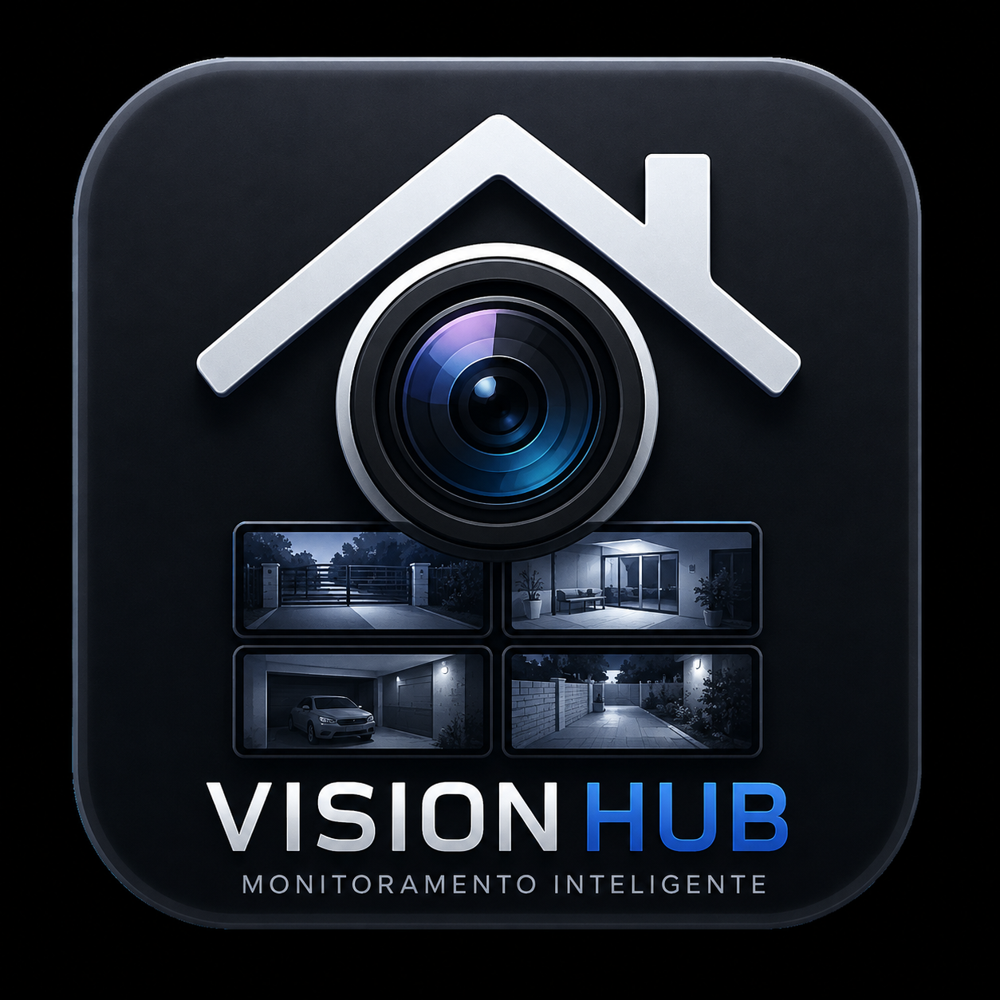

# VisionHub

<p align="center">
  
</p>

VisionHub é um reprodutor desktop pensado para capturar e exibir imagens de
quaisquer câmeras de segurança compatíveis com o protocolo RTSP. O projeto pode
usar um mosaico 2×2 para quatro câmeras ou 4×2 para oito câmeras, conforme a
necessidade. O programa permite
ampliar uma câmera, entrar em tela cheia, reproduzir o áudio de um canal por vez
e controlar o volume individualmente.

O vídeo é processado pelo OpenCV e o áudio é reproduzido pelo `ffplay`. O
assistente inicial coleta os dados do NVR, protege a senha no cofre de
credenciais do sistema e mantém as demais configurações em um arquivo `.env`.

## Licença

Este projeto é distribuído sob a [Licença MIT](LICENSE). O programa pode ser
usado, copiado, modificado e distribuído, desde que o aviso de autoria e a
licença sejam mantidos como citação da fonte original.

## Recursos

- Visualização simultânea de quatro ou oito canais RTSP.
- Modo ampliado para uma câmera.
- Tela cheia com restauração do tamanho e da posição anteriores.
- Redimensionamento das imagens sem distorção.
- Reprodução de áudio iniciada no modo silencioso.
- Controle de volume por câmera.
- Apenas uma câmera com áudio ativo por vez, evitando sobreposição.
- Instância única para evitar acessos duplicados ao cofre de credenciais.
- Reconexão automática com espera progressiva.
- Indicação de câmera online, desconectada ou em reconexão.
- Opção para exibir ou suprimir mensagens de erro de conexão do OpenCV/FFmpeg.

## Requisitos

- Python 3.10 ou superior.
- Tkinter, normalmente incluído na instalação do Python.
- FFmpeg com o executável `ffplay`, necessário para o áudio.
- NVR ou câmeras acessíveis pela rede e com RTSP habilitado.

### Instalando o FFmpeg

No macOS com Homebrew:

```bash
brew install ffmpeg
```

No Ubuntu ou Debian:

```bash
sudo apt update
sudo apt install ffmpeg python3-tk
```

No Windows, instale o FFmpeg e adicione a pasta que contém `ffplay.exe` à
variável `PATH`. Como alternativa, informe seu caminho completo em
`FFPLAY_PATH` no `.env`.

Confirme a instalação:

```bash
ffplay -version
```

## Instalação

Clone ou abra o projeto e entre em sua pasta:

```bash
cd visuonhub
```

Crie um ambiente virtual:

```bash
python3 -m venv .venv
```

Ative o ambiente no macOS ou Linux:

```bash
source .venv/bin/activate
```

No Windows PowerShell:

```powershell
.venv\Scripts\Activate.ps1
```

Instale as dependências:

```bash
python -m pip install -r requirements.txt
```

## Configuração

Crie o `.env` a partir do modelo:

```bash
cp .env.example .env
```

No Windows PowerShell:

```powershell
Copy-Item .env.example .env
```

Edite o `.env` com os dados do equipamento:

```env
NVR_IP=192.168.1.100
NVR_RTSP_PORT=554
NVR_USER=admin
NVR_PASSWORD=troque_por_sua_senha
NVR_STREAM=1
CAMERA_COUNT=4
CAMERA_1_NAME=Entrada
CAMERA_2_NAME=Garagem
CAMERA_3_NAME=Sala
CAMERA_4_NAME=Quintal
SUPPRESS_CONNECTION_ERRORS=off
CONNECTION_ATTEMPTS=3

WINDOW_WIDTH=1280
WINDOW_HEIGHT=720
WINDOW_SCALE=0.92
IMAGE_FIT=contain
UI_FPS=15
AUDIO_VOLUME=50
RECONNECT_SECONDS=3.0
RECONNECT_MAX_SECONDS=60.0
```

O `.env` está ignorado pelo Git e não deve ser enviado ao repositório, pois
contém as credenciais do NVR.

### Variáveis disponíveis

| Variável | Obrigatória | Padrão | Descrição |
| --- | --- | --- | --- |
| `NVR_IP` | Sim | — | Endereço IP ou nome do NVR. |
| `NVR_RTSP_PORT` | Não | `554` | Porta do serviço RTSP. |
| `NVR_USER` | Sim | — | Usuário com acesso aos canais. |
| `NVR_PASSWORD` | Sim | — | Senha do usuário. |
| `NVR_STREAM` | Não | `1` | `0` para stream principal ou `1` para substream. |
| `CAMERA_COUNT` | Não | `4` | Quantidade de câmeras: `4` (grade 2×2) ou `8` (grade 4×2). |
| `CAMERA_N_NAME` | Não | `Câmera N` | Nome exibido para cada câmera, substituindo `N` pelo canal de `1` a `8`. Quando ausente, vazio ou indefinido, o número do canal é usado automaticamente. |
| `SUPPRESS_CONNECTION_ERRORS` | Não | `off` | Use `on` para ocultar mensagens de erro de conexão do OpenCV/FFmpeg. |
| `CONNECTION_ATTEMPTS` | Não | `3` | Tentativas consecutivas antes de manter o canal como “Sem conexão”. |
| `WINDOW_WIDTH` | Não | `1280` | Largura usada para calcular a proporção da janela. |
| `WINDOW_HEIGHT` | Não | `720` | Altura usada para calcular a proporção da janela. |
| `WINDOW_SCALE` | Não | `0.92` | Fração da tela utilizada pela janela, entre `0.5` e `1.0`. |
| `IMAGE_FIT` | Não | `contain` | `cover` preenche o quadro; `contain` preserva toda a imagem. |
| `UI_FPS` | Não | `15` | Frequência máxima de atualização da interface. |
| `AUDIO_VOLUME` | Não | `50` | Volume inicial, entre `0` e `100`. |
| `FFPLAY_PATH` | Não | Detectado no `PATH` | Caminho completo do executável `ffplay`. |
| `RECONNECT_SECONDS` | Não | `3.0` | Espera inicial entre tentativas de conexão. |
| `RECONNECT_MAX_SECONDS` | Não | `60.0` | Espera máxima entre novas tentativas. |

### Canais e URL RTSP

O VisionHub cria automaticamente os canais sequenciais de acordo com o valor
de `CAMERA_COUNT`. O endereço de cada canal é montado no seguinte formato:

```text
rtsp://usuario:senha@ip:porta/avstream/channel=CANAL/stream=STREAM.sdp
```

Para usar oito câmeras, configure:

```env
CAMERA_COUNT=8
```

Os nomes exibidos nos painéis podem ser personalizados no `.env`:

```env
CAMERA_1_NAME=Entrada principal
CAMERA_2_NAME=Garagem
CAMERA_3_NAME=Sala
CAMERA_4_NAME=Quintal
```

Quando um nome não é preenchido, o programa utiliza automaticamente
`Câmera N`, sendo `N` o número do canal.

## Executando

Com o ambiente virtual ativado:

```bash
python main.py
```

## Instaladores

Para gerar e testar instaladores localmente, consulte os guias de build para
[macOS, Linux e Windows](docs/README.md).

O workflow `Gerar instaladores e release` cria automaticamente arquivos com o
número definido em `visionhub/version.py`, por exemplo:

- `VisionHub-1.1.0-beta.3-Windows-Setup.exe`, para Windows 11 de 64 bits.
- `VisionHub-1.1.0-beta.3-macOS.dmg`, contendo o aplicativo para macOS.

Ele pode ser executado manualmente na aba **Actions** do GitHub ou
automaticamente ao publicar uma tag iniciada por `v`. Quando a tag corresponde
à versão do código, os instaladores também são anexados a uma GitHub Release
para download público. Versões com sufixo, como `-beta.1`, são marcadas como
pré-lançamento.

### Publicando uma versão beta

1. Atualize `__version__` em `visionhub/version.py` seguindo o formato
   `MAJOR.MINOR.PATCH-beta.N`.
2. Registre as alterações da versão no `CHANGELOG.md`.
3. Crie um commit com essas mudanças.
4. Crie e envie uma tag exatamente igual à versão, prefixada por `v`:

```bash
git tag -a v1.1.0-beta.3 -m "VisionHub 1.1.0 beta 3"
git push origin main
git push origin v1.1.0-beta.3
```

O workflow valida se a tag e `__version__` são iguais. Depois dos builds nativos,
ele publica a release `VisionHub 1.1.0-beta.3` com o `.exe` e o `.dmg`. Não crie
a tag antes de concluir e enviar o commit da versão.

Na primeira execução, o aplicativo solicita o endereço do NVR, a porta RTSP, o
usuário e a senha. Os dados não sensíveis são salvos em:

```text
~/.visionhub/.env
```

No Windows, `~` representa a pasta do usuário, por exemplo
`C:\Users\usuario`. No macOS, representa `/Users/usuario`. A senha não é gravada
nesse arquivo: ela fica no Cofre de Credenciais do Windows ou nas Chaves do
macOS. Nos próximos acessos, esses dados são carregados automaticamente.
Durante o desenvolvimento, o programa continua reconhecendo o `.env` da raiz
do projeto. Se uma instalação anterior possuir senha no `.env`, ela será
migrada para o cofre seguro e removida do arquivo no próximo acesso.

O `ffplay` não é incluído nos instaladores. Para usar áudio, instale o FFmpeg e
deixe o executável disponível no `PATH`, conforme descrito nos requisitos.

Para builds locais no macOS com Python 3.14 e Tcl/Tk 9, utilize o PyInstaller
definido em `requirements-build.txt`. Versões anteriores à `6.18` não possuem o
suporte necessário para esse conjunto de versões.

O áudio começa fechado. O VisionHub não abre nenhuma reprodução de áudio até
que o botão de alto-falante de uma câmera seja acionado.

## Controles

### Controles dos painéis

- **Ampliar:** faz a câmera preencher toda a área da janela.
- **Mosaico:** devolve a câmera ampliada à grade configurada.
- **Tela cheia:** abre a câmera escolhida ocupando toda a tela.
- **Restaurar:** sai da tela cheia e recupera a visualização anterior.
- **Áudio:** ativa ou silencia o áudio da câmera correspondente.
- **Volume:** ajusta o volume daquela câmera de `0` a `100`.
- **Duplo clique:** alterna entre câmera ampliada e mosaico.

Ao ativar o áudio de outra câmera, o canal anterior é silenciado
automaticamente.

### Atalhos de teclado

| Atalho | Ação |
| --- | --- |
| `F11` | Alterna a tela cheia preservando a visualização atual. |
| `Command + F` | Alterna a tela cheia no macOS. |
| `Esc` | Sai da tela cheia ou retorna uma câmera ampliada ao mosaico. |
| `Enter` ou `Espaço` | Aciona um botão vetorial que esteja com foco. |

## Ajuste da imagem

O modo `cover` preenche todo o painel sem deformar a imagem. Dependendo da
proporção da câmera, uma pequena parte das bordas pode ser recortada:

```env
IMAGE_FIT=cover
```

Para sempre mostrar o quadro completo, aceitando possíveis bordas pretas:

```env
IMAGE_FIT=contain
```

## Estrutura do projeto

```text
.
├── main.py                 # Ponto de entrada
├── requirements.txt        # Dependências Python
├── .env.example            # Modelo de configuração
└── visionhub/
    ├── __init__.py         # Interface pública do pacote
    ├── app.py              # Janela, mosaico e interações
    ├── config.py           # Ambiente, validações e câmeras
    ├── media.py            # Vídeo RTSP e áudio
    └── widgets.py          # Painéis, controles e ícones
```

## Solução de problemas

### A câmera mostra “Sem conexão”

Verifique:

- Se o NVR e a câmera estão ligados e acessíveis na rede.
- Se o canal está online no painel do NVR.
- Se a porta RTSP está habilitada e corresponde a `NVR_RTSP_PORT`.
- Se usuário e senha possuem acesso à visualização ao vivo.
- Se o número configurado em `CAMERAS` corresponde ao canal real.

O VisionHub realiza três tentativas de conexão com intervalos progressivos. Se
nenhuma delas funcionar, o quadro permanece como “Sem conexão” e só volta a
tentar quando o programa for reiniciado. Por padrão, as mensagens de erro são
exibidas no terminal. Para ocultar mensagens repetitivas do OpenCV/FFmpeg,
configure:

```env
SUPPRESS_CONNECTION_ERRORS=on
```

### Erro `DESCRIBE failed: 500 Internal Server Error`

Esse retorno normalmente indica que o NVR recebeu a solicitação, mas rejeitou o
canal ou stream. Teste se o canal está online e alterne temporariamente entre:

```env
NVR_STREAM=0
```

e:

```env
NVR_STREAM=1
```

### A imagem aparece, mas não há áudio

- Confirme que a câmera transmite áudio no mesmo fluxo RTSP.
- Verifique se `ffplay -version` funciona no terminal.
- Confirme que o botão de alto-falante da câmera está ativo.
- Aumente o controle de volume do painel e o volume do sistema operacional.
- Se necessário, defina `FFPLAY_PATH` com o caminho completo do executável.

### O `ffplay` não foi encontrado

Localize o executável:

```bash
command -v ffplay
```

Depois informe o resultado no `.env`, por exemplo:

```env
FFPLAY_PATH=/opt/homebrew/bin/ffplay
```

### Tkinter não está disponível no Linux

Em distribuições baseadas em Ubuntu ou Debian:

```bash
sudo apt install python3-tk
```

## Segurança

- Não publique o arquivo `.env`.
- Nos aplicativos instalados, a senha é armazenada pelo cofre seguro do sistema
  operacional e não é escrita no `.env`.
- Use um usuário do NVR com apenas as permissões necessárias.
- Evite expor a porta RTSP diretamente à internet.
- Prefira executar o VisionHub na mesma rede local ou por uma VPN confiável.
